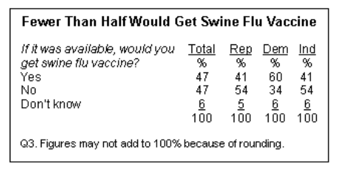
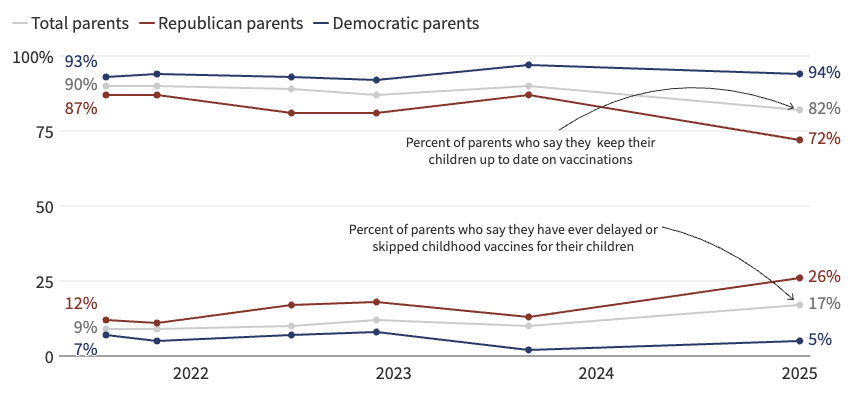
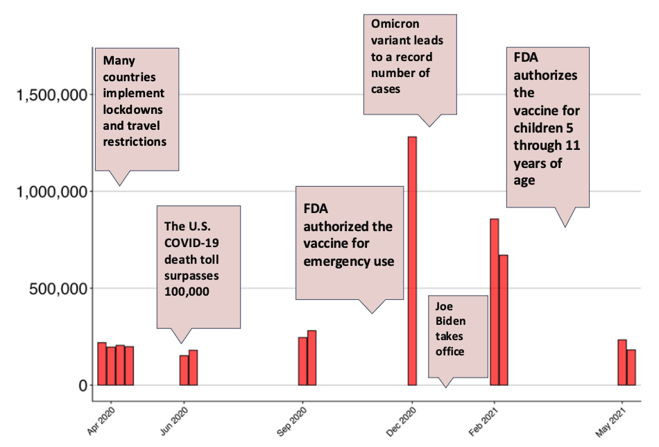

```{r setup, include=FALSE}
library(tidyverse)
library(knitr)

paper_stats <- readRDS("../out/tables/paper_statistics.rds")
list2env(paper_stats, envir = environment())

fig_path <- "../paper/jhsb_submission/partisan_differences_files/figure-html"
fig <- function(name) file.path(fig_path, paste0(name, "-1.png"))
```

## The Partisan Mortality Divide {background-color="#f8f8f8"}

```{r}
#| out-width: "80%"
#| fig-align: center
include_graphics(fig("fig-county-mortality"))
```

::: {.caption-note}
Republican-leaning counties initially had lower mortality; by fall 2020 the pattern reversed and persisted through the end of the pandemic.
:::

::: {.notes}
- Daily COVID-19 deaths per 100,000 residents, 2020–2023; lines for Democratic-leaning, Mixed, and Republican-leaning counties (classified by 2020 presidential vote share)
- Spring 2020: Democratic-leaning counties had *higher* death rates — virus arrived first in dense, urban areas (New York, New Jersey)
- By fall 2020 the lines cross and never come back — every major surge from winter 2021 onward hits Republican counties harder
- At the winter 2021 peak: Republican-leaning counties had death rates ~50% higher than Democratic-leaning counties
- Caveat: county-level data — can't conclude Republican *individuals* died at higher rates (ecological fallacy); counties also differ on age structure, healthcare access, rurality
- But striking enough to ask: is there something about partisan identity itself — not just where partisans live — that shapes the health behaviors driving these outcomes? That's the individual-level question we test.
:::


## From Counties to Individuals

**The ecological pattern raises an individual-level question:**

> Do Republicans and Democrats actually *behave* differently in ways that could produce differential mortality?

- County-level correlations can't tell us whether individuals differ
- Sorting, urbanicity, and demographics could explain away aggregate gaps
- We need *behavioral* data on individuals, not county-level proxies

::: {.notes}
This slide bridges the aggregate puzzle to our contribution. Stress that we're not committing the ecological fallacy — county patterns motivate the question, individual data test it. The BICS study gives us exactly what we need: actual contact counts and mask-wearing during specific interactions, not abstract attitudes.
:::


# Theory & Data {background-color="#2c3e50" style="color:white;"}

Why would partisanship shape health behavior — and what would prove it does?


## A. Partisanship and Health: Not a COVID Invention

::: {.columns}
::: {.column width="55%"}
- **2009 H1N1 ("swine flu")**: Republican-leaning states had significantly lower uptake of the H1N1 vaccine — driven largely by partisan media self-selection and differential trust in public health authorities (Baum 2011)
- **Vaccine attitudes**: Political ideology and party ID have been consistent predictors of vaccine hesitancy well before COVID, tied to differential trust in science and government (Baumgaertner et al. 2018; Gauchat 2025)
- **The pattern is not new** — COVID accelerated and made visible a long-standing structure
:::
::: {.column width="42%"}
{width="100%"}

::: {style="font-size: 0.55em; color: gray; margin-top: 4px;"}
Source: Pew Research Center, 2009
:::
:::
:::

::: {.notes}
Baum (2011) "Red State, Blue State, Flu State" is the key citation here — partisan gaps in swine flu vaccination in 2009, driven by media self-selection. Republicans who consumed conservative media were less likely to get vaccinated, not because of any policy difference but because the information environment shaped their perception of risk. This is the clearest pre-COVID precedent.
:::


## B. The Partisan Gap in Public Health Perception Has Grown

::: {.columns}
::: {.column width="55%"}
- Trust in the CDC, FDA, and public health authorities has diverged sharply along partisan lines over the past two decades
- Early in COVID (March–April 2020), partisan perception gaps in threat severity were already large — and grew rapidly (Gadarian et al. 2021)
- By fall 2020, Democrats and Republicans were living in essentially different information realities about the severity of the pandemic
- **COVID didn't create the divide — it widened it**
:::
::: {.column width="42%"}
{width="100%"}

::: {style="font-size: 0.55em; color: gray; margin-top: 4px;"}
Source: KFF Tracking Poll on Health Information and Trust, 2025
:::
:::
:::

::: {.notes}
Gadarian, Goodman & Pepinsky (2021) "Partisanship, health behavior, and policy attitudes in the early stages of the COVID-19 pandemic" is the key panel study here. They show that partisan gaps in concern, behavior, and policy support were large from the very start of the pandemic and grew over time. Also worth noting: elite cue divergence was early — Green et al. (2020) show that congressional Democrats and Republicans were already sending divergent messages about COVID by mid-February 2020, weeks before the first lockdowns.
:::


## C. Documented Behavioral Differences During COVID

A wide range of studies document partisan gaps in COVID protective behavior:

- **Social distancing & mobility**: Republicans reduced mobility less than Democrats in the early pandemic (Allcott et al. 2020; Gollwitzer et al. 2020)
- **Mask wearing**: Large partisan gaps in self-reported and observed masking (Grossman et al. 2020)
- **Vaccination**: Republican partisans vaccinated at lower rates; Trump support specifically predicts hesitancy (Gadarian et al. 2024)
- **Mortality consequences**: Republican-leaning counties had higher COVID death rates, widening after vaccine availability (Wallace et al. 2023)

::: {.notes}
Key citations: Allcott et al. (2020) use smartphone mobility data to show Republicans reduced movement less. Gollwitzer et al. (2020) link partisan physical distancing to county-level health outcomes. Grossman et al. (2020) use a natural experiment around governor recommendations. Wallace et al. (2023) is the most striking: excess death rates were 43% higher among registered Republicans than Democrats after vaccines became available. Gadarian et al. (2024) show it's specifically Trump support — not generic party ID — that drives vaccine hesitancy.
:::


## D. Partisanship as Social Identity

::: {.columns}
::: {.column width="55%"}
**Identity theory predicts:**

- Group membership → in-group conformity
- Boundary maintenance → symbolic differentiation
- Durable dispositions (habitus) → behavioral regularities
:::
::: {.column width="42%"}
**The key question isn't *whether* gaps exist — it's *why* they persist.**

If partisanship functions as a fundamental social identity (like race or religion), behavioral gaps should survive:

- Different policy environments
- Different geographic contexts
- Demographic controls
- Even controlling for stated risk perceptions
:::
:::

::: {.notes}
SCRIPT FOR SLIDE D:

"So where does that leave us theoretically? The prior slides established that partisan health gaps are real, they predate COVID, and they've been documented across many outcomes. The question is: why?

The framework I want to propose is that partisanship has become what sociologists call a *fundamental social identity* — something like race or religion — that organizes how people see the world and how they behave in it. This comes from Henri Tajfel's social identity theory: when people categorize themselves as group members, they internalize group norms and act in ways that signal belonging.

What that predicts for health behavior is pretty specific. First, *in-group conformity* — you do what your group does, not just what's rational from an individual risk standpoint. Second, *symbolic differentiation* — behaviors become markers of who you are and who you're not. Wearing or not wearing a mask stopped being purely a health decision and became a statement. Third, *durable dispositions* — Cockerham's health lifestyles framework tells us these aren't one-off choices, they're patterned regularities that persist across situations.

The COVID context turbocharged this process. Elite partisan cues diverged almost immediately — by March 2020, Republican and Democratic politicians were already sending different signals about the severity of the threat. Mask mandates became party-coded. Vaccines became a litmus test. So health behaviors got pulled into an existing partisan identity structure that was already very strong.

Now, the key theoretical move in our paper is this: *if* partisanship is a fundamental identity that drives behavior, then behavioral gaps should be *portable*. They shouldn't disappear when you move to a different state, or a different policy environment, or control for demographics. Identity travels with you. That's what we test — and that's what the next section shows."
:::


## Competing Explanations & Testable Predictions

| Explanation | If true, gaps should... |
|---|---|
| **1. Demographic sorting** | Disappear after controlling age, race, education, metro |
| **2. Policy environment** | Disappear within the same mandate regime |
| **3. Geographic / contextual factors** | Disappear within the same region or urban/rural setting |
| **4. Local partisan context** | Be smaller when living in an opposing-party area |
| **5. Risk perception** | Disappear after controlling for stated concern |
| **6. Severity override** | Narrow during high-mortality periods |
| **7. Identity dominates** | **Persist across all of the above** ← our hypothesis |

::: {.notes}
This is the analytical framework for the rest of the talk. Each subsequent findings section is a test of one or more rows. Walk the audience through it quickly — the payoff is that we test them all. The "portable polarization" label is the outcome when explanation 7 is what we find.
:::


## Data: Berkeley Interpersonal Contact Study (BICS)

::: {.columns}
::: {.column width="40%"}
**Design:**

- 6 survey waves: April 2020 — May 2021
- N = `r format(n_total, big.mark=",")` respondents
- Nationally representative (weighted)
- Raked weights: match Gallup 2020 party targets

**Partisan composition (weighted):**

- <span class="dem">Democrats</span>: `r round(pct_dem)`%  (n = `r format(n_dem, big.mark=",")`)
- <span class="ind">Independents</span>: `r round(pct_ind)`%  (n = `r format(n_ind, big.mark=",")`)
- <span class="rep">Republicans</span>: `r round(pct_rep)`%  (n = `r format(n_rep, big.mark=",")`)

**Key measures:**

- **Contacts:** Face-to-face contacts the day prior
- **Masks:** % of contacts with mask worn
- **Perceived severity:** "How concerned are you about COVID-19?" (4 levels)
:::
::: {.column width="57%"}
{width="100%"}
:::
:::

::: {.notes}
Emphasize the measurement quality. BICS captures actual behaviors in a concrete recall task rather than general behavioral dispositions. This is important for the partisan bias critique — counting face-to-face contacts yesterday is harder to distort expressively than reporting general attitudes. Also note the raked weights — we adjust for party ID to match Gallup targets, so our sample isn't over-representing engaged partisans.

**On raked weights (if asked):** Raked weights are an algorithm that adjusts the sample to match the national distribution on multiple characteristics simultaneously. Our standard weights already match Census targets on age, gender, race, and education. Raking adds party ID: it further adjusts weights so the weighted sample also matches Gallup 2020 benchmarks (~30% Democrat, 29% Republican, 39% Independent). Online surveys tend to oversample politically engaged, educated respondents who skew Democratic — without this correction, we'd be comparing a non-representative Democrat sample to a non-representative Republican sample. Raking ensures each party group is weighted to reflect its true share of the U.S. adult population.
:::


## Linked Data Sources

::: {.columns}
::: {.column width="50%"}
**Individual-level survey**

- **BICS** — 6 waves, April 2020–May 2021; contacts, masks, vaccination, perceived severity, demographics

**County-level COVID outcomes**

- **JHU CSSE** — county-level confirmed cases (lagged weekly incidence) and deaths (lagged weekly mortality)
- **U.S. Census Bureau** — county population denominators for rate calculation
:::
::: {.column width="50%"}
**Geographic & policy covariates**

- **USDA ERS Rural-Urban Continuum Codes (2013)** — county metro/non-metro classification
- **Wright et al. (2020)** — "Tracking Mask Mandates During the Covid-19 Pandemic" (austinlwright.com/covid-research); county-level mandate timing classified as strict / less strict / none
- **MIT Election Lab / FEC 2020** — 2020 U.S. House vote share by congressional district (local partisan context)
:::
:::

::: {.notes}
This slide is for methodological questions — you don't need to walk through it in the main talk. The key point is that the individual survey data is linked to several county-level and geographic datasets, which is what allows us to control for local COVID severity, policy environment, and partisan context. All linkages go through ZIP code → county and congressional district crosswalks.
:::


# Core Findings {background-color="#2c3e50" style="color:white;"}

Substantial, consistent partisan gaps — surviving demographics, time, and context.

::: {.notes}
Before diving into results, it's worth pausing on *why these particular outcomes matter* — not just as health behaviors, but as inputs to how disease spreads.

Epidemiological models of infectious disease transmission — SIR-type models and their extensions — have two key behavioral parameters: the rate of contact between people, and the probability of transmission per contact. Mask use directly reduces transmission probability. Daily contact counts determine who is exposed in the first place.

Most disease models assume these parameters are either fixed or vary smoothly across the population. What our study shows is that they vary *systematically* by partisanship — and by a lot. Republicans in our data reported roughly one more daily contact than Democrats across the study period, and their mask usage was substantially lower. These aren't small differences: a one-contact gap compounds dramatically in a network, and a 10-20 percentage point mask gap translates directly into higher per-contact transmission risk.

This means that if you're trying to model COVID spread and you treat the population as homogeneous — or even just control for age and urbanicity — you're missing a major source of behavioral heterogeneity. Partisan identity predicts contact rates and masking behavior above and beyond the demographics modelers typically account for.

The downstream implication: models that ignore partisan heterogeneity will misestimate R₀, will predict convergent epidemic trajectories when the actual trajectories diverge by partisanship, and will generate misleading projections about intervention effectiveness. That's not an abstract methodological concern — it has real consequences for public health planning.
:::


## Partisan Gaps Across All Three Behaviors

```{r}
#| fig-align: center
#| fig-width: 10
#| fig-height: 4
#| out-width: "95%"
library(cowplot)

party_colors <- c("Democrat" = "#326ba4", "Independent" = "#6db753", "Republican" = "#c50000")

base_data <- tibble(
  party = factor(rep(c("Republican", "Independent", "Democrat"), 2),
                 levels = c("Republican", "Independent", "Democrat")),
  behavior = rep(c("A. Daily Contacts", "B. Mask Usage (%)"), each = 3),
  value = c(contacts_rep, contacts_ind, contacts_dem,
            mask_rep,     mask_ind,     mask_dem)
)

make_panel <- function(df, ylimits = NULL, expand = c(0, 0.15)) {
  ggplot(df, aes(x = party, y = value, fill = party)) +
    geom_col(alpha = 0.7, width = 0.7, color = "black") +
    geom_text(aes(label = sprintf("%.1f", value)),
              vjust = -0.5, size = 3.5, fontface = "bold") +
    scale_fill_manual(values = party_colors) +
    labs(x = NULL, y = NULL, title = unique(df$behavior)) +
    theme_cowplot() +
    theme(legend.position = "none",
          axis.text.x  = element_text(size = 11),
          plot.title   = element_text(face = "bold", size = 12),
          strip.background = element_blank()) +
    scale_y_continuous(expand = expansion(mult = expand), limits = ylimits)
}

p_a <- make_panel(filter(base_data, behavior == "A. Daily Contacts"))
p_b <- make_panel(filter(base_data, behavior == "B. Mask Usage (%)"), ylimits = c(0, 100), expand = c(0, 0.05))

plot_grid(p_a, p_b, nrow = 1, align = "h", rel_widths = c(1, 1))
```

::: {.notes}
Show the basic finding. Republicans: more contacts (`r round(contacts_rep, 1)` vs `r round(contacts_dem, 1)` for Dems), less masking (`r round(mask_rep)`% vs `r round(mask_dem)`%). Independents fall in between. Both behaviors, same directional pattern. This is the baseline for everything that follows.
:::


## How Large Is the Mask Gap?

```{r}
#| out-width: "100%"
#| fig-height: 4.0
library(tidyverse)
library(emmeans)
library(cowplot)

bics_raw <- read_csv("../data/BICS_ZIP_Features.csv", show_col_types = FALSE)
bics_all  <- filter(bics_raw, political_party %in% c("Democrat", "Republican", "Independent")) |>
  mutate(nonmetro = 1 - Metro)
bics_rd   <- filter(bics_all, political_party %in% c("Democrat", "Republican"))

get_contr <- function(fit, spec) {
  summary(emmeans(fit, specs = as.formula(paste("pairwise ~", spec)))$contrasts) |>
    as.data.frame()
}

run_contrasts <- function(outcome) {
  bind_rows(
    get_contr(lm(as.formula(paste(outcome, "~ young")),          bics_all, weights = weight_pooled), "young"),
    get_contr(lm(as.formula(paste(outcome, "~ nonmetro")),       bics_all, weights = weight_pooled), "nonmetro"),
    get_contr(lm(as.formula(paste(outcome, "~ republican")),     bics_rd,  weights = weight_pooled), "republican"),
    get_contr(lm(as.formula(paste(outcome, "~ r_college_grad")), bics_all, weights = weight_pooled), "r_college_grad"),
    get_contr(lm(as.formula(paste(outcome, "~ white")),          bics_all, weights = weight_pooled), "white"),
    get_contr(lm(as.formula(paste(outcome, "~ male")),           bics_all, weights = weight_pooled), "male")
  ) |>
    mutate(
      raw_label = c("Young–Old", "Non-Metro–\nMetro", "Rep.–Dem.",
                    "College–\nNo College", "White–\nNon-White", "Male–\nNon-Male"),
      fill_col  = c("other", "other", "rep", "other", "other", "other")
    )
}

cc_contr   <- run_contrasts("num_cc")
mask_contr <- run_contrasts("Norm_Masks_Used")

# Sort each panel independently by its own absolute gap (largest first)
cc_order   <- cc_contr   |> arrange(desc(abs(estimate))) |> pull(raw_label)
mask_order <- mask_contr |> arrange(desc(abs(estimate))) |> pull(raw_label)
cc_contr   <- cc_contr   |> mutate(label = factor(raw_label, levels = cc_order))
mask_contr <- mask_contr |> mutate(label = factor(raw_label, levels = mask_order))

make_contrast_panel <- function(contrasts, title, flip = FALSE) {
  df <- mutate(contrasts,
               est = if (flip) estimate else -estimate,
               lo  = if (flip) estimate - SE else -(estimate + SE),
               hi  = if (flip) estimate + SE else -(estimate - SE))
  ggplot(df, aes(x = label, y = est, fill = fill_col)) +
    geom_col(width = 0.65, color = "black", linewidth = 0.3, alpha = 0.85) +
    geom_errorbar(aes(ymin = lo, ymax = hi), width = 0.22, linewidth = 0.6) +
    geom_hline(yintercept = 0, linetype = "dashed", color = "gray40") +
    scale_fill_manual(values = c("rep" = "#922b21", "other" = "gray60"), guide = "none") +
    labs(title = title, x = NULL, y = NULL) +
    theme_minimal(base_size = 11) +
    theme(
      panel.grid.major.x = element_blank(),
      panel.grid.minor   = element_blank(),
      plot.title  = element_text(size = 11, face = "bold"),
      axis.text.x = element_text(size = 9),
      axis.text.y = element_text(size = 9)
    )
}

p_cc   <- make_contrast_panel(cc_contr,   "A. Difference in Daily Contacts")
p_mask <- make_contrast_panel(mask_contr, "B. Difference in Mask Usage (%)")

plot_grid(p_cc, p_mask, nrow = 1, align = "h")
```

::: {.notes}
This is the magnitude point to hammer home. The partisan mask gap is not just statistically significant — it's substantively larger than most other standard demographic predictors. This puts partisan identity in conversation with race, gender, and class as a structuring force for health behavior.
:::


## But These Groups Really Do Differ Demographically

```{r}
#| ft.align: center
library(flextable)

demo_tbl <- tibble(
  Characteristic = c("N", "Mean age (years)", "Male (%)", "White (%)",
                     "College graduate (%)", "Metropolitan (%)",
                     "Employed (%)", "Mean household size"),
  Democrat    = c(format(n_dem,  big.mark = ","),
                  sprintf("%.1f", age_dem),     sprintf("%.1f", male_dem),
                  sprintf("%.1f", white_dem),   sprintf("%.1f", college_dem),
                  sprintf("%.1f", metro_dem),   sprintf("%.1f", employed_dem),
                  sprintf("%.2f", hhsize_dem)),
  Independent = c(format(n_ind,  big.mark = ","),
                  sprintf("%.1f", age_ind),     sprintf("%.1f", male_ind),
                  sprintf("%.1f", white_ind),   sprintf("%.1f", college_ind),
                  sprintf("%.1f", metro_ind),   sprintf("%.1f", employed_ind),
                  sprintf("%.2f", hhsize_ind)),
  Republican  = c(format(n_rep,  big.mark = ","),
                  sprintf("%.1f", age_rep),     sprintf("%.1f", male_rep),
                  sprintf("%.1f", white_rep),   sprintf("%.1f", college_rep),
                  sprintf("%.1f", metro_rep),   sprintf("%.1f", employed_rep),
                  sprintf("%.2f", hhsize_rep))
)

flextable(demo_tbl) %>%
  set_header_labels(Characteristic = "") %>%
  bold(part = "header") %>%
  color(j = "Democrat",    color = "#1a5276", part = "body") %>%
  color(j = "Independent", color = "#2d7a4f", part = "body") %>%
  color(j = "Republican",  color = "#922b21", part = "body") %>%
  bold(j = c("Democrat", "Independent", "Republican"), part = "body") %>%
  fontsize(size = 18, part = "all") %>%
  fontsize(size = 20, part = "header") %>%
  align(j = c("Democrat", "Independent", "Republican"), align = "center", part = "all") %>%
  align(j = "Characteristic", align = "left", part = "all") %>%
  width(j = "Characteristic", width = 2.4) %>%
  width(j = c("Democrat", "Independent", "Republican"), width = 1.5) %>%
  bg(part = "header", bg = "#2c3e50") %>%
  color(part = "header", color = "white") %>%
  border_remove() %>%
  hline(part = "body", border = officer::fp_border(color = "#dddddd", width = 0.5)) %>%
  set_table_properties(layout = "autofit")
```

*Partisan groups differ on every dimension known to predict health behavior — a plausible case that gaps are just demographics in disguise.*

::: {.notes}
This slide motivates the first several tests. The groups genuinely differ: Republicans in BICS skew older, whiter, more male, and less metro than Democrats. These are precisely the demographic variables that independently predict risk-taking and mask skepticism. So the hypothesis that behavioral gaps are just demographics in disguise is scientifically reasonable — not a straw man. That's what makes Test 1 important: we need to actually check.
:::


# Adjudicating the Competing Explanations {background-color="#2c3e50" style="color:white;"}

Each test asks: *where this theory says gaps should narrow — do they?*


## Three Competing Hypotheses

::: {.incremental}

**H1 — Demographic composition**

Partisan gaps in health behavior are a byproduct of who joins each party. Republicans are older, whiter, more rural, and less educated — demographics that independently predict lower mask use and more contacts. Control for composition and the gap disappears.

**H2a — Contextual differences**

Republicans and Democrats live in different places and under different rules. Republicans face less strict mandates, live in lower-density areas, reside in regions with different cultural norms, and experienced different local mortality levels. Context, not identity, drives behavior.

**H2b — Subjective perceptions and information environment**

Partisans may receive different information about the pandemic and live in environments that shape their perceived severity of COVID-19. If Republicans genuinely perceived lower risk — because their communities were less hard-hit, or because they consumed different media — behavioral differences may reflect rational responses to different perceived realities, not identity per se.

**H3 — Partisan identity as an independent predictor**

Even after accounting for who partisans are, where they live, and what they perceive, partisan identity itself shapes health behavior — through identity-consistent norms, elite cue-taking, and the expressive value of visible behaviors like masking.

:::

::: {.notes}
Frame these as genuine scientific alternatives, not straw men. H1, H2a, and H2b are all reasonable — the groups DO differ demographically, DO live in different contexts, and DO report different levels of concern. The tests that follow are designed to adjudicate: H1 predicts gaps disappear after demographic controls; H2a predicts gaps shrink within the same policy/geographic context; H2b predicts gaps shrink among partisans with matched levels of concern. If none of these work, that's evidence for H3.
:::


## Test 1 — Demographics Don't Explain It

::: {.columns}
::: {.column width="45%"}
**Theory predicts:**

If partisan gaps reflect demographic sorting — Republicans are older, whiter, less educated, more rural — controlling for demographics should eliminate behavioral differences.

<br>

::: {.verdict-box .verdict-persist}
**Verdict: Gaps persist after controls.** Adjusting for age, gender, race, education, and metro status barely moves the needle.
:::
:::
::: {.column width="52%"}
```{r}
#| fig-width: 6
#| fig-height: 4.5
#| out-width: "100%"
library(cowplot)
library(broom)

bics_reg <- read_csv("../data/BICS_ZIP_Features.csv", show_col_types = FALSE) %>%
  filter(political_party %in% c("Democrat", "Republican")) %>%
  mutate(party = relevel(factor(political_party), ref = "Democrat"),
         wave  = factor(wave))

# Unadjusted gaps
raw_contacts <- lm(num_cc ~ party, data = bics_reg, weights = weight_pooled)
raw_masks    <- lm(Norm_Masks_Used ~ party, data = bics_reg, weights = weight_pooled)

# Adjusted gaps (+ wave + demographics)
adj_contacts <- lm(num_cc ~ party + wave + age_group + resp_sex + r_race + resp_educ + Metro,
                   data = bics_reg, weights = weight_pooled)
adj_masks    <- lm(Norm_Masks_Used ~ party + wave + age_group + resp_sex + r_race + resp_educ + Metro,
                   data = bics_reg, weights = weight_pooled)

extract_rep <- function(model, label, spec) {
  tidy(model, conf.int = TRUE) %>%
    filter(str_detect(term, "Republican")) %>%
    transmute(estimate, conf.low, conf.high,
              outcome = label, spec = spec)
}

plot_data <- bind_rows(
  extract_rep(raw_contacts, "Daily Contacts", "Unadjusted"),
  extract_rep(adj_contacts, "Daily Contacts", "Adjusted"),
  extract_rep(raw_masks,    "Mask Usage (%)", "Unadjusted"),
  extract_rep(adj_masks,    "Mask Usage (%)", "Adjusted")
) %>%
  mutate(spec = factor(spec, levels = c("Unadjusted", "Adjusted")))

ggplot(plot_data, aes(x = spec, y = estimate, color = spec)) +
  geom_hline(yintercept = 0, linetype = "dashed", color = "gray50") +
  geom_pointrange(aes(ymin = conf.low, ymax = conf.high),
                  size = 0.8, linewidth = 1.1) +
  scale_color_manual(values = c("Unadjusted" = "#c50000", "Adjusted" = "#7570b3")) +
  facet_wrap(~ outcome, scales = "free_y", nrow = 1) +
  labs(x = NULL, y = "Republican − Democrat gap",
       caption = "Adjusted for age, gender, race/ethnicity, education, metro, and wave. Error bars = 95% CI.") +
  theme_cowplot() +
  theme(legend.position  = "none",
        strip.text       = element_text(face = "bold", size = 11),
        strip.background = element_blank(),
        plot.caption     = element_text(size = 8, color = "gray50"))
```
:::
:::

::: {.notes}
Test 1. The unadjusted vs. adjusted comparison makes the argument immediately visible: the two points barely move. Controlling for all major demographic predictors doesn't close the gap. This rules out explanation #2 — partisan gaps aren't just demographic sorting in disguise.
:::


## Test 2 — Urban/Rural Doesn't Explain It

::: {.columns}
::: {.column width="45%"}
**Theory predicts:**

Urban/rural differences in density, risk, and local culture might account for partisan differences in behavior.

<br>

::: {.verdict-box .verdict-persist}
**Verdict: Gaps persist within metro and non-metro areas.** Urban Republicans still had more contacts and less mask use than urban Democrats.
:::
:::
::: {.column width="52%"}
```{r}
#| out-width: "100%"
include_graphics(fig("fig-metro-gaps"))
```
:::
:::

::: {.notes}
Test 2. Often the urban/rural divide is assumed to drive partisan health differences because Republicans are more rural and rural areas have lower density. But within metro areas, gaps remain. This rules out density-based explanations.
:::


## Test 3 — Policy Doesn't Explain It

::: {.columns}
::: {.column width="45%"}
**Theory predicts:**

If gaps reflect policy compliance, they should disappear within the same mandate environment — Democrats and Republicans under the same rules should behave the same.

<br>

::: {.verdict-box .verdict-persist}
**Verdict: Gaps persist within all policy environments.** Policy regime shifts absolute behavior levels but does not close the partisan divide.
:::
:::
::: {.column width="52%"}
```{r}
#| fig-width: 6
#| fig-height: 5
#| out-width: "100%"
library(cowplot)

behaviors_by_policy <- read_csv("../out/tables/behaviors_by_policy.csv",
                                show_col_types = FALSE) %>%
  mutate(
    political_party = factor(political_party, levels = c("Republican", "Independent", "Democrat")),
    policy = factor(policy, levels = c("No Mandate", "Less Strict", "Strict"))
  )

party_colors <- c("Democrat" = "#326ba4", "Independent" = "#6db753", "Republican" = "#c50000")

p_a <- ggplot(behaviors_by_policy,
              aes(x = policy, y = contacts_mean, fill = political_party)) +
  geom_col(position = position_dodge(0.8), width = 0.7, color = "black", alpha = 0.8) +
  geom_errorbar(aes(ymin = contacts_mean - contacts_se,
                    ymax = contacts_mean + contacts_se),
                position = position_dodge(0.8), width = 0.2) +
  scale_fill_manual(values = party_colors) +
  scale_y_continuous(expand = expansion(mult = c(0, 0.1))) +
  labs(x = NULL, y = "Daily Contacts",
       title = "A. Contacts by Mask Mandate", fill = NULL) +
  theme_cowplot() +
  theme(plot.title = element_text(face = "bold", size = 10),
        legend.position = "none",
        axis.text.x = element_text(size = 9))

p_c <- ggplot(behaviors_by_policy,
              aes(x = policy, y = mask_mean, fill = political_party)) +
  geom_col(position = position_dodge(0.8), width = 0.7, color = "black", alpha = 0.8) +
  geom_errorbar(aes(ymin = mask_mean - mask_se,
                    ymax = mask_mean + mask_se),
                position = position_dodge(0.8), width = 0.2) +
  scale_fill_manual(values = party_colors) +
  scale_y_continuous(expand = expansion(mult = c(0, 0.1)), limits = c(0, 85)) +
  labs(x = NULL, y = "Mask Usage (%)",
       title = "B. Masks by Mask Mandate", fill = NULL) +
  theme_cowplot() +
  theme(plot.title = element_text(face = "bold", size = 10),
        legend.position = "bottom",
        legend.text = element_text(size = 9),
        axis.text.x = element_text(size = 9))

plot_grid(p_a, p_c, nrow = 2, align = "v", rel_heights = c(1, 1.15))
```
:::
:::

::: {.notes}
Test 3. Within the same mask mandate regime, partisan gaps persist. Both contacts and masks show the same pattern: policy shifts the absolute level but the Republican-Democrat gap remains. This rules out the policy explanation.
:::


## Test 4 — Severity Asymmetry: Contacts Compress, Masks Widen

```{r}
#| fig-align: center
#| fig-width: 11
#| fig-height: 4.5
#| out-width: "90%"
library(cowplot)
library(patchwork)

wave_label_map <- c("1"="Apr '20","2"="Jun '20","3"="Sep '20",
                    "4"="Dec '20","5"="Feb '21","6"="May '21")

gaps_by_wave <- read_csv("../out/tables/gaps_by_wave.csv", show_col_types = FALSE) %>%
  mutate(wave_label = factor(wave_label_map[as.character(wave)],
                             levels = wave_label_map))

max_mort      <- max(gaps_by_wave$mean_mort_rate)
contact_scale <- max(gaps_by_wave$contacts_gap) / max_mort * 1.3
mask_scale    <- max(gaps_by_wave$mask_gap)     / max_mort * 1.3

p_contact_gap <- ggplot(gaps_by_wave, aes(x = wave_label)) +
  geom_col(aes(y = mean_mort_rate * contact_scale),
           fill = "gray70", alpha = 0.5, width = 0.7) +
  geom_line(aes(y = contacts_gap, group = 1), color = "#7570b3", linewidth = 1.3) +
  geom_point(aes(y = contacts_gap), color = "#7570b3", size = 4) +
  geom_text(aes(y = contacts_gap, label = sprintf("%.1f", contacts_gap)),
            vjust = -1.2, size = 3.8, fontface = "bold") +
  geom_hline(yintercept = 0, linetype = "dashed", color = "gray50") +
  scale_y_continuous(
    name = "R−D Gap (contacts/day)",
    sec.axis = sec_axis(~ . / contact_scale, name = "Mortality (per 100k)"),
    expand = expansion(mult = c(0.05, 0.2))
  ) +
  labs(x = NULL, title = "A. Contact Gap (Republican − Democrat)") +
  theme_cowplot() +
  theme(plot.title = element_text(face = "bold", size = 11),
        axis.text.x = element_text(angle = 45, hjust = 1),
        axis.title.y.right = element_text(color = "gray50", size = 9))

p_mask_gap <- ggplot(gaps_by_wave, aes(x = wave_label)) +
  geom_col(aes(y = mean_mort_rate * mask_scale),
           fill = "gray70", alpha = 0.5, width = 0.7) +
  geom_line(aes(y = mask_gap, group = 1), color = "#1b9e77", linewidth = 1.3) +
  geom_point(aes(y = mask_gap), color = "#1b9e77", size = 4) +
  geom_text(aes(y = mask_gap, label = sprintf("%.1f", mask_gap)),
            vjust = -1.2, size = 3.8, fontface = "bold") +
  geom_hline(yintercept = 0, linetype = "dashed", color = "gray50") +
  scale_y_continuous(
    name = "D−R Gap (percentage points)",
    sec.axis = sec_axis(~ . / mask_scale, name = "Mortality (per 100k)"),
    expand = expansion(mult = c(0.05, 0.2))
  ) +
  labs(x = NULL, title = "B. Mask Gap (Democrat − Republican)") +
  theme_cowplot() +
  theme(plot.title = element_text(face = "bold", size = 11),
        axis.text.x = element_text(angle = 45, hjust = 1),
        axis.title.y.right = element_text(color = "gray50", size = 9))

p_contact_gap + p_mask_gap +
  plot_annotation(caption = "Gray bars = local mortality rate during each wave (right axis).")
```

::: {.columns}
::: {.column width="52%"}
**Theory predicts:** If severity overrides partisanship, behavioral gaps should narrow or close during high-mortality periods.
:::
::: {.column width="45%"}
::: {.verdict-box .verdict-narrow}
**Verdict: Contact gap compresses during mortality surges (Dec '20, Feb '21); mask gap widens regardless — the two behaviors follow different logics.**
:::
:::
:::

::: {.notes}
Test 4 — the most theoretically nuanced finding. Look at the left panel: the contact gap (R−D) is largest in spring 2020 (+2.2), then compresses during the winter 2020–21 surge (+0.8 in Dec, +0.5 in Feb), before widening again in May 2021. The contact gap tracks mortality — when conditions were objectively worst, partisans converged on cautious behavior. Now look at the right panel: the mask gap grows steadily from spring 2020 through spring 2021, from about 5pp to 23pp, with no compression during the mortality surge. The same pandemic, the same partisans, two completely different behavioral logics. Private behavior (contacts) responds to objective risk. Public behavior (masks) tracks group identity regardless of conditions. This asymmetry sets up the visibility mechanism.
:::


## Test 5 — Stated Concern Doesn't Account for It

```{r}
#| out-width: "88%"
#| fig-height: 4.2
#| fig-align: center
include_graphics(fig("fig-concern-gaps"))
```

::: {.columns}
::: {.column width="52%"}
**Theory predicts:** If Democrats are more careful because they're more worried about COVID-19, controlling for risk perception should eliminate behavioral gaps.
:::
::: {.column width="45%"}
::: {.verdict-box .verdict-persist}
**Verdict: Gaps remain even among the equally concerned — and even among the unconcerned.** Among the "very concerned," <span class="dem">Dems</span> still masked at `r round(mask_vc_dem)`% vs. <span class="rep">Reps</span> at `r round(mask_vc_rep)`%.
:::
:::
:::

::: {.notes}
Test 5. Severity asymmetry showed masks don't track objective conditions — now the question is whether subjective perception explains it. Even when we compare Democrats and Republicans who express identical levels of concern, behavioral gaps remain at every concern level. Crucially, Democrats who say they are "not at all concerned" still mask more than Republicans who say the same. Stated concern itself is partially performative — expressive of group membership rather than genuine cognitive risk assessment. Masks signal identity, not risk response. Rules out explanation #5.
:::


## Test 6 — Geography Doesn't Explain It

::: {.columns}
::: {.column width="40%"}
**Theory predicts:**

If regional culture or local conditions drive differences, gaps should narrow or disappear within the same region.

<br>

::: {.verdict-box .verdict-persist}
**Verdict: Gaps are present in every Census region.** Where gaps are smaller (South), it's because Democrats behave less cautiously — not because Republicans become more cautious.
:::
:::
::: {.column width="58%"}

```{r}
#| include: false
library(tidyverse)
library(cowplot)

region_data <- read_csv("../out/tables/adj_behaviors_by_region.csv", show_col_types = FALSE) |>
  filter(political_party %in% c("Democrat", "Republican")) |>
  mutate(
    party  = factor(political_party, levels = c("Democrat", "Republican")),
    region = factor(census_region, levels = c("Northeast", "Midwest", "South", "West"))
  )

party_colors <- c("Democrat" = "#1a5276", "Republican" = "#922b21")

make_region_bar <- function(data, y_var, se_var, y_label, y_limits = NULL) {
  ggplot(data, aes(x = region, y = .data[[y_var]], fill = party)) +
    geom_col(position = position_dodge(0.75), width = 0.68,
             color = "black", linewidth = 0.25, alpha = 0.85) +
    geom_errorbar(aes(ymin = .data[[y_var]] - .data[[se_var]],
                      ymax = .data[[y_var]] + .data[[se_var]]),
                  position = position_dodge(0.75), width = 0.2, linewidth = 0.5) +
    scale_fill_manual(values = party_colors, name = NULL) +
    scale_x_discrete(labels = c("Northeast" = "NE", "Midwest" = "MW",
                                 "South" = "South", "West" = "West")) +
    (if (!is.null(y_limits))
       scale_y_continuous(limits = y_limits, expand = expansion(mult = c(0, 0.05)))
     else
       scale_y_continuous(expand = expansion(mult = c(0, 0.1)))) +
    labs(x = NULL, y = y_label) +
    theme_minimal(base_size = 11) +
    theme(legend.position = "bottom", legend.text = element_text(size = 10),
          panel.grid.minor = element_blank(), panel.grid.major.x = element_blank(),
          axis.text = element_text(size = 9), plot.margin = margin(4, 8, 4, 4))
}

region_levels_plot <- plot_grid(
  make_region_bar(region_data, "contacts_adj_mean", "contacts_adj_se", "Daily Contacts (adj.)"),
  make_region_bar(region_data, "mask_adj_mean", "mask_adj_se", "Mask Usage, % (adj.)", y_limits = c(0, 90)),
  nrow = 1, align = "h",
  labels = c("A. Contacts", "B. Masks"), label_size = 10, label_fontface = "plain"
)
```

::: {.r-stack}

::: {.fragment .fade-out fragment-index=1}
```{r}
#| out-width: "100%"
#| fig-align: center
include_graphics(fig("fig-region-gap-map"))
```
:::

::: {.fragment .fade-in fragment-index=1}
```{r}
#| out-width: "100%"
#| fig-height: 3.8
region_levels_plot
```
:::

:::

:::
:::

::: {.notes}
Test 6. The gap map uses weighted descriptive means (weight_party_raked). The level bar plot uses emmeans from OLS models: num_cc ~ party * region + wave + log(mortality), weighted by weight_party_raked. Marginal means are evaluated at average wave and mortality conditions, so the bars show what each party's behavior would look like in an average wave/mortality context. SEs are emmeans model-based SEs. The adjustment for wave and local mortality rules out that regional gaps simply reflect when surveys were conducted or how severe COVID was locally — the partisan gap within each region survives those controls.
:::


## Test 7 — Local Partisan Context Doesn't Explain It

```{r}
#| include: false
library(tidyverse)
library(cowplot)

cd_data <- read_csv("../out/tables/behaviors_by_opposing_cd.csv", show_col_types = FALSE) |>
  filter(political_party %in% c("Democrat", "Republican")) |>
  mutate(
    party = factor(political_party, levels = c("Democrat", "Republican")),
    context = factor(opposing_cd,
      levels = c("Same-party CD", "Opposing-party CD"),
      labels = c("Same-party\ndistrict", "Opposing-party\ndistrict")
    )
  )

party_colors <- c("Democrat" = "#1a5276", "Republican" = "#922b21")

# Gap plot (initial view)
cd_gaps <- cd_data |>
  select(context, party, contacts_mean, contacts_se, mask_mean, mask_se) |>
  pivot_wider(names_from = party,
              values_from = c(contacts_mean, contacts_se, mask_mean, mask_se)) |>
  mutate(
    contacts_gap     = contacts_mean_Republican - contacts_mean_Democrat,
    contacts_gap_se  = sqrt(contacts_se_Republican^2 + contacts_se_Democrat^2),
    mask_gap         = mask_mean_Democrat - mask_mean_Republican,
    mask_gap_se      = sqrt(mask_se_Democrat^2 + mask_se_Republican^2)
  )

make_gap_panel <- function(data, gap_var, se_var, y_label) {
  ggplot(data, aes(x = context, y = .data[[gap_var]])) +
    geom_col(width = 0.5, fill = "gray50", alpha = 0.8, color = "black", linewidth = 0.3) +
    geom_errorbar(aes(ymin = .data[[gap_var]] - 1.96 * .data[[se_var]],
                      ymax = .data[[gap_var]] + 1.96 * .data[[se_var]]),
                  width = 0.15, linewidth = 0.8) +
    geom_hline(yintercept = 0, linetype = "dashed", color = "gray40") +
    scale_y_continuous(expand = expansion(mult = 0.15)) +
    labs(x = NULL, y = y_label) +
    theme_minimal(base_size = 14) +
    theme(panel.grid.minor = element_blank(), panel.grid.major.x = element_blank(),
          axis.text = element_text(size = 13), axis.title.y = element_text(size = 13),
          plot.margin = margin(4, 16, 4, 4))
}

# Level plot (animated in)
make_cd_panel <- function(data, y_var, se_var, y_label) {
  ggplot(data, aes(x = context, y = .data[[y_var]], color = party, group = party)) +
    geom_line(linewidth = 0.8, linetype = "dashed", alpha = 0.5,
              position = position_dodge(0.2)) +
    geom_pointrange(
      aes(ymin = .data[[y_var]] - 1.96 * .data[[se_var]],
          ymax = .data[[y_var]] + 1.96 * .data[[se_var]]),
      size = 0.8, linewidth = 1.4, position = position_dodge(0.2)
    ) +
    scale_color_manual(values = party_colors, name = NULL) +
    scale_x_discrete(expand = expansion(mult = 0.3)) +
    scale_y_continuous(expand = expansion(mult = 0.15)) +
    labs(y = y_label, x = NULL) +
    theme_minimal(base_size = 14) +
    theme(legend.position = "bottom", legend.text = element_text(size = 13),
          panel.grid.minor = element_blank(), panel.grid.major.x = element_blank(),
          axis.text = element_text(size = 13), axis.title.y = element_text(size = 13),
          plot.margin = margin(4, 16, 4, 4))
}

gap_plot <- plot_grid(
  make_gap_panel(cd_gaps, "contacts_gap", "contacts_gap_se", "Contact Gap (Rep − Dem)"),
  make_gap_panel(cd_gaps, "mask_gap",     "mask_gap_se",     "Mask Gap (Dem − Rep, pp)"),
  nrow = 1, align = "h",
  labels = c("A. Contacts", "B. Masks"),
  label_size = 13, label_fontface = "plain", label_x = 0.5, label_hjust = 0.5
)

level_plot <- plot_grid(
  make_cd_panel(cd_data, "contacts_mean", "contacts_se", "Daily Contacts"),
  make_cd_panel(cd_data, "mask_mean",     "mask_se",     "Mask Usage (%)"),
  nrow = 1, align = "h",
  labels = c("A. Contacts", "B. Masks"),
  label_size = 13, label_fontface = "plain", label_x = 0.5, label_hjust = 0.5
)
```

::: {.r-stack}

::: {.fragment .fade-out fragment-index=1}
```{r}
#| out-width: "90%"
#| fig-height: 4.0
#| fig-align: center
gap_plot
```
:::

::: {.fragment .fade-in fragment-index=1}
```{r}
#| out-width: "90%"
#| fig-height: 4.0
#| fig-align: center
level_plot
```
:::

:::

::: {.columns}
::: {.column width="52%"}
**Theory predicts:** Cross-cutting exposure should moderate gaps through social influence and norm exposure.
:::
::: {.column width="45%"}
::: {.verdict-box .verdict-persist}
**Verdict: Contact gap is stable; mask gap narrows in cross-cutting contexts — but both parties' behavior shifts, not just one.**
:::
:::
:::

::: {.notes}
Test 7. Lead with gaps: contacts gap is nearly identical in same-party (1.19) and opposing-party (1.18) districts — context has no effect on contacts. The mask gap collapses from 20.7pp in same-party districts to near zero in opposing-party districts, but this is because BOTH parties shift: Democrats in Republican CDs wear fewer masks (pulled down by local norms) while Republicans in Democratic CDs wear more masks (pushed up). Click reveals the levels: the lines converge in opposing-party districts because context moves both baselines toward each other, not because partisan identity disappears.
:::


## "Portable Polarization"

Partisan gaps in health behavior proved **remarkably robust** across every context we tested:

<div class="pp-grid">
<div class="pp-cell"><span class="pp-check">✓</span><br><strong>Policy Environment</strong><br>Persists within same mandate regime</div>
<div class="pp-cell"><span class="pp-check">✓</span><br><strong>Geography</strong><br>Persists in all 4 Census regions</div>
<div class="pp-cell"><span class="pp-check">✓</span><br><strong>Urban / Rural</strong><br>Persists within metro and non-metro</div>
<div class="pp-cell"><span class="pp-check">✓</span><br><strong>Local Partisan Context</strong><br>Persists in opposing-party districts</div>
</div>

<br>

> **Partisan identity overrides local culture, policy environment, and geographic context — behavioral differences travel with the partisan.**

::: {.notes}
This is the conceptual heart of the paper. The portable polarization label captures the finding that gaps don't shrink when you control for the contexts where each alternative theory predicted they should. Behavioral differences are properties of individuals, not environments. This is what we'd expect if partisan identity has become a fundamental social identity in Tajfel's sense.
:::


# The Visibility Mechanism {background-color="#2c3e50" style="color:white;"}

Private behavior tracked risk. Public behavior tracked group identity.


## Private vs. Public Behavior

::: {.columns}
::: {.column width="48%"}
::: {.private-col}
**Social Contacts** *(private)*

- Largely unobservable by political community
- Cannot easily signal partisan allegiance
- Gap **narrowed** when mortality surged
- Stakes were immediate, concrete, personal

<span class="arrow-conclusion">→ Behavior tracked objective conditions</span>
:::
:::
::: {.column width="48%"}
::: {.public-col}
**Mask-Wearing** *(public)*

- Instantly legible social signal
- Visually communicates group membership
- Gap **widened** monotonically
- Meaning was politically activated

<span class="arrow-conclusion">→ Behavior tracked group norms</span>
:::
:::
:::

<br>

> If gaps were driven purely by risk perceptions or health lifestyles, **both behaviors should diverge equally** — they didn't. The difference is social observability.

::: {.notes}
This is the theoretical core of the visibility mechanism argument. If the same underlying factor (risk perception, health dispositions) drove both behaviors, we'd expect similar divergence patterns. Instead they went in opposite directions — contacts compressed, masks widened. The difference is social observability: masks are publicly legible, contacts are private. This points to identity-driven processes operating selectively on visible behaviors.
:::


## Key Takeaways

::: {.fragment}
**1. Partisan differences in health behaviors are real and large**

Republicans had more daily contacts and significantly lower mask use than Democrats across all six waves — gaps larger than those observed for race, gender, or education.
:::

::: {.fragment}
**2. Demographics don't explain them away**

Republicans are older, whiter, more male, and more rural — all of which independently predict riskier behavior. But controlling for all of these barely moves the needle. The partisan gap is not a demographic artifact.
:::

::: {.fragment}
**3. Context matters, but doesn't override partisan identity**

The gap is smallest in the South and local partisan context does shift mask behavior — Democrats in Republican districts mask less, Republicans in Democratic districts mask more. But gaps persist in every region, every policy environment, and every urbanicity level. Local culture bends the baseline; it does not close the divide.
:::

::: {.fragment}
**4. Severity shapes *contacts* more than *masks* — and more than stated concern**

Contact gaps compress during mortality surges, suggesting Republicans do respond to objective conditions even when they say they are not concerned. But stated concern does not explain mask gaps — partisans at the same level of concern still behave differently. For masks, behavior tracks identity; for contacts, behavior tracks actual risk.
:::

::: {.notes}
This is the summary slide before moving to implications. Walk through each point briefly. The fourth point is the most nuanced — it distinguishes between objective severity (which moves contacts) and stated concern (which doesn't explain masks). The key insight is that "not concerned" Republicans still reduce contacts when mortality is high, meaning the lever is concrete local conditions, not stated cognition. Masks follow a different logic entirely.
:::


# Implications {background-color="#2c3e50" style="color:white;"}

For theory, public health practice, and the sociology of health.


## Theoretical Contributions

**1. Partisan identity as a master status in health**

- Extends Tajfel (identity → behavior) and Cockerham (collective forces structure health lifestyles) to partisanship
- Partisan gap in mask-wearing exceeded race, gender, education, and urbanicity

**2. "Portable polarization" as a concept**

- Behavioral differences are *properties of individuals*, not environments
- Gaps survive all contextual tests where alternatives predicted narrowing

**3. The competing-theories framework**

- Descriptive data can constrain causal explanations
- Testing where each theory predicts gaps *should* disappear is more informative than testing whether gaps exist

**4. Visibility as a moderator of identity-driven health behavior**

- Social observability determines whether identity processes activate
- Private vs. public behaviors diverge even within the same individuals

::: {.notes}
Summarize theoretical contributions. This is what we want the audience to take away as "the paper's argument." Hit each point briefly.
:::


## Limitations

**1. We can rule out explanations, but can't establish causation**

BICS is repeated cross-sectional — we observe different people each wave, not the same people over time. We can show that gaps *persist* after controlling for demographics and context, but we can't show that partisan identity itself *caused* the behavioral change. Longitudinal or experimental designs would be needed to establish direction.

<br>

**2. We measure party ID, not Trump support**

Republican vs. Democrat is a coarse proxy. I suspect that *Trump support specifically* — not party registration — is the stronger driver: the mask skepticism and contact patterns likely concentrate among strong Trump supporters, with traditional Republicans behaving differently. Party ID conflates these.

<br>

**3. We lack religiosity**

Religious affiliation and attendance are correlated with both Republican identity and with social contact patterns (in-person services, community gatherings). Without religiosity controls, we can't rule out that some of the "partisan" gap is actually a religious community effect.

::: {.notes}
Be direct about these. The causation point is the most important methodologically — we're doing principled pattern-matching, not causal identification. The Trump support point is actually a theoretical refinement: if the mechanism is identity-consistent behavior cued by elite signals, Trump supporters received a much stronger and more consistent anti-mask signal than generic Republicans. The religiosity gap is a real omitted variable concern, especially for contacts — evangelical communities maintained in-person gatherings longer, and skew Republican.
:::


## Implications for Public Health Communication

- Even among respondents who say they are **not at all concerned** about COVID-19, Democrats masked more than Republicans who said the same — concern and behavior are **decoupled along partisan lines**

- Stated concern is expressed in identity-consistent ways: it reflects what group members are *supposed* to say, not just their private risk assessment

- **Messaging designed to increase stated concern may change survey responses without changing behavior** — if mask use is anchored to group norms rather than personal worry, raising concern does not necessarily move the lever that controls protective action

::: {.notes}
This is the public health punchline from Test 5. The standard health behavior model assumes: increase perceived risk → increase protective behavior. Our data suggest that for mask use specifically, this pathway is blocked or bypassed by partisan identity. Democrats who aren't worried still mask; Republicans who are worried still don't. The implication is not that risk communication is useless, but that it needs to work through different mechanisms for highly identity-governed behaviors — social norm messaging, trusted community voices, or reframing behaviors so they don't carry partisan valence.
:::


## Implications for Disease Modeling

::: {.columns}
::: {.column width="50%"}
**1. Partisan identity should be a model parameter**

Standard compartmental models stratify by age, sex, and sometimes geography — but not political identity. Our findings suggest this is a meaningful omission. Republicans and Democrats have systematically different contact rates and mask compliance, and **age stratification alone won't solve it**: partisan gaps persist *within* age groups. A model that ignores this heterogeneity will misestimate transmission dynamics in politically polarized populations.
:::
::: {.column width="48%"}
**2. Context modulates the parameter, even if it doesn't eliminate it**

Partisan identity doesn't operate in a vacuum. Local mortality conditions, policy environment, and regional culture all shift the *baseline* level of behaviors — contacts compress during surges, mask rates rise under strict mandates. The partisan gap is portable, but the absolute behaviors it produces vary with context. Accurate modeling requires both: **identity-stratified contact and compliance rates** that are also **sensitive to local contextual conditions**.
:::
:::

::: {.notes}
This is the applied contribution. The disease modeling audience cares about behavioral heterogeneity in transmission models — who contacts whom, and how protected those contacts are. We can offer two precise contributions: (1) party ID is a meaningful stratification variable, above and beyond age and geography; (2) the behavioral parameters aren't fixed — they interact with local mortality and policy context. A model that treats Republicans and Democrats as exchangeable will underestimate between-group transmission differences, and a model that ignores contextual modulation will get the temporal dynamics wrong.
:::


## Conclusion: Partisanship as a Structuring Force in Health

::: {.columns}
::: {.column width="50%"}

**A. Contact gaps are context-sensitive**

Republicans reduce contacts as mortality rises — consistent with genuine risk response. Reducing contact is a *private act*: it costs nothing tribally, so it yields to objective conditions.

<br>

**B. Mask gaps follow the opposite logic**

Polarization in mask-wearing *widens* as the pandemic worsens. Masking is a low-cost, visible signal — cheap to maintain as a tribal marker even under rising threat.

:::
::: {.column width="48%"}

**C. Context moves behavior — but not identity**

Partisans surrounded by political opponents shift somewhat toward opposing norms. Yet gaps persist. Local context bends the baseline; it does not close the divide.

<br>

**D. Partisan identity is an independent behavioral force**

Robust to demographics, policy, geography, and stated concern — partisanship predicts behavior beyond what any contextual account can explain.

:::
:::

::: {.notes}
Close on the theoretical payoff. The two-behavior asymmetry is the most theoretically interesting finding: the same partisans, facing the same pandemic, respond differently depending on whether the behavior is privately consequential (contacts) or publicly visible (masks). This maps onto a distinction between behavior driven by genuine risk assessment versus behavior serving an expressive, identity-signaling function. The broader claim: partisan identity now operates like race or religion in structuring health behavior — not as a proxy for something else, but as its own independent force.
:::


## Thank You

**Questions?**

<br>

::: {.columns}
::: {.column width="60%"}
**Paper:** *Portable Polarization: Partisan Differences in COVID-19 Health Behaviors*

**Data:** Berkeley Interpersonal Contact Study (BICS)
6 waves, April 2020 – May 2021
N = `r format(n_total, big.mark=",")`

**Key finding:** Partisan gaps in health behaviors — social contacts and mask-wearing — persisted across every policy environment, geographic context, and demographic control we tested.
:::
::: {.column width="37%"}
**Key statistics:**

- Mask gap: `r round(mask_dem - mask_rep, 1)` pp (Dem vs. Rep)
- Contact gap: `r round(contacts_rep - contacts_dem, 1)` more daily contacts (Rep)
- Gaps survived: policy, region, urban/rural, local partisanship, risk perception
:::
:::

::: {.notes}
Leave key stats visible for Q&A reference. Be ready to discuss: (1) the expressive responding critique, (2) the causal identification problem, (3) implications for current health politicization (vaccines, chronic disease, reproductive health).
:::


# Additional Slides {background-color="#2c3e50" style="color:white;"}


## Mask Gap Among the "Very Concerned" Over Time

```{r}
#| fig-align: center
#| fig-width: 9
#| fig-height: 4.2
#| out-width: "88%"
library(tidyverse)
library(cowplot)

wave_label_map <- c("2"="Jun '20","3"="Sep '20","4"="Dec '20","5"="Feb '21","6"="May '21")

vc_data <- read_csv("../out/tables/mask_among_very_concerned_by_wave.csv",
                    show_col_types = FALSE) |>
  filter(political_party %in% c("Democrat", "Republican")) |>
  mutate(
    party      = factor(political_party, levels = c("Democrat", "Republican")),
    wave_label = factor(wave_label_map[as.character(wave)], levels = wave_label_map)
  )

party_colors <- c("Democrat" = "#1a5276", "Republican" = "#922b21")

ggplot(vc_data, aes(x = wave_label, y = mask_usage, color = party, group = party)) +
  geom_line(linewidth = 1.3) +
  geom_point(size = 4) +
  geom_text(aes(label = sprintf("%.0f%%", mask_usage)),
            vjust = -1.2, size = 3.6, fontface = "bold") +
  scale_color_manual(values = party_colors, name = NULL) +
  scale_y_continuous(labels = function(x) paste0(x, "%"),
                     limits = c(55, 95),
                     expand = expansion(mult = c(0.05, 0.15))) +
  labs(x = NULL, y = "Mask Usage (%)",
       caption = "Sample restricted to respondents who said they were 'very concerned' about COVID-19.") +
  theme_cowplot() +
  theme(legend.position  = "bottom",
        legend.text      = element_text(size = 12),
        axis.text        = element_text(size = 11),
        plot.caption     = element_text(size = 9, color = "gray50"))
```

::: {.notes}
This is the supporting evidence for Test 5. Even among respondents who all said they were "very concerned" about COVID-19 — identical stated concern — the partisan mask gap grew substantially over time. Early in the pandemic (Jun '20) Republicans who were very concerned actually masked at similar or higher rates than Democrats. By Feb '21, a large gap had opened. Concern held constant; behavior diverged. This is the clearest illustration that stated concern is not the mechanism driving differential masking.
:::


## Behavior Levels by Census Region

```{r}
#| out-width: "95%"
#| fig-height: 4.0
#| fig-align: center
region_data <- read_csv("../out/tables/adj_behaviors_by_region.csv", show_col_types = FALSE) |>
  filter(political_party %in% c("Democrat", "Republican")) |>
  mutate(
    party  = factor(political_party, levels = c("Democrat", "Republican")),
    region = factor(census_region, levels = c("Northeast", "Midwest", "South", "West"))
  )

party_colors <- c("Democrat" = "#1a5276", "Republican" = "#922b21")

make_region_panel <- function(data, y_var, se_var, y_label, y_limits = NULL) {
  ggplot(data, aes(x = region, y = .data[[y_var]], fill = party)) +
    geom_col(position = position_dodge(0.75), width = 0.68,
             color = "black", linewidth = 0.25, alpha = 0.85) +
    geom_errorbar(aes(ymin = .data[[y_var]] - .data[[se_var]],
                      ymax = .data[[y_var]] + .data[[se_var]]),
                  position = position_dodge(0.75), width = 0.2, linewidth = 0.5) +
    scale_fill_manual(values = party_colors, name = NULL) +
    scale_x_discrete(labels = c("Northeast" = "NE", "Midwest" = "MW",
                                 "South" = "South", "West" = "West")) +
    (if (!is.null(y_limits))
       scale_y_continuous(limits = y_limits, expand = expansion(mult = c(0, 0.05)))
     else
       scale_y_continuous(expand = expansion(mult = c(0, 0.1)))) +
    labs(x = NULL, y = y_label) +
    theme_minimal(base_size = 11) +
    theme(
      legend.position  = "bottom",
      legend.text      = element_text(size = 10),
      panel.grid.minor = element_blank(),
      panel.grid.major.x = element_blank(),
      axis.text        = element_text(size = 9),
      plot.margin      = margin(4, 8, 4, 4)
    )
}

p_contacts <- make_region_panel(region_data, "contacts_adj_mean", "contacts_adj_se", "Daily Contacts (adj.)")
p_masks    <- make_region_panel(region_data, "mask_adj_mean",     "mask_adj_se",     "Mask Usage, % (adj.)", y_limits = c(0, 90))

plot_grid(p_contacts, p_masks, nrow = 1, align = "h",
          labels = c("A. Contacts", "B. Masks"),
          label_size = 10, label_fontface = "plain")
```
